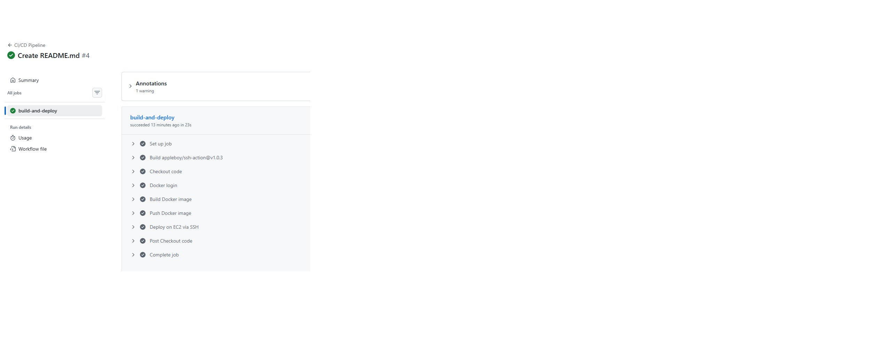
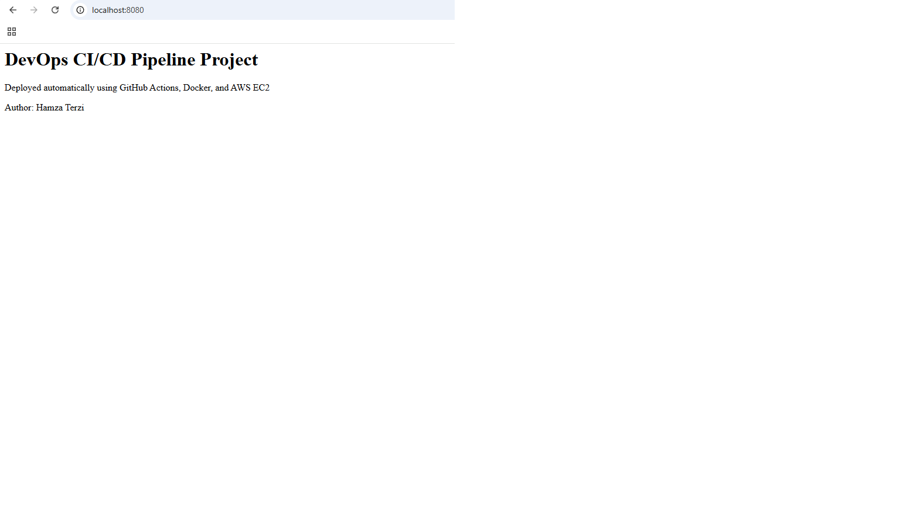
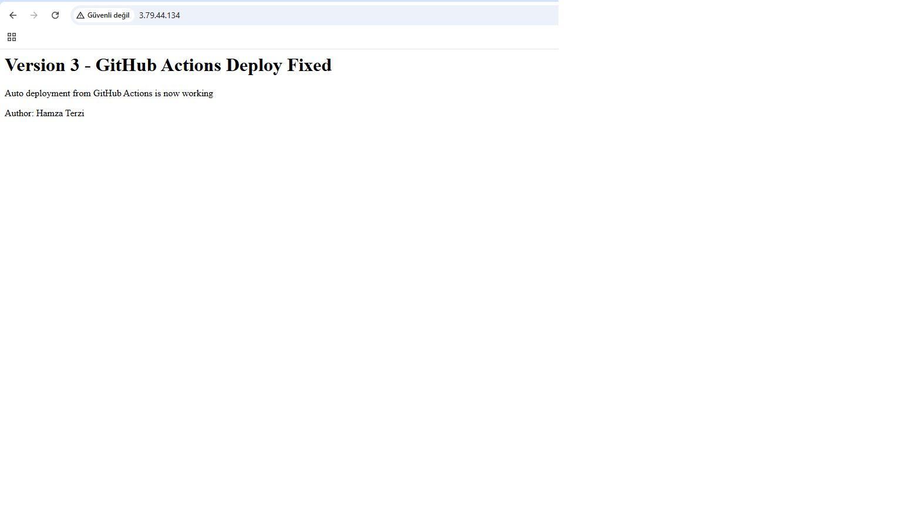

DevOps CI/CD Pipeline Project

This project demonstrates a complete CI/CD pipeline using GitHub Actions, Docker, Docker Hub, and AWS EC2.
The application is automatically built and deployed to an AWS EC2 instance after each GitHub push.

Architecture

Developer
   |
   v
GitHub Repository
   |
   v
GitHub Actions (CI/CD Pipeline)
   |
   v
Docker Image Build
   |
   v
Docker Hub (Image Registry)
   |
   v
AWS EC2 (SSH Connection)
   |
   v
Docker Container (Nginx Web Server)
   |
   v
Web Application (Port 80)

CI/CD Pipeline Flow
Developer pushes code to GitHub
GitHub Actions pipeline is triggered
Docker image is built automatically
Docker image is pushed to Docker Hub
GitHub Actions connects to AWS EC2 via SSH
EC2 server pulls the latest Docker image
Existing container is stopped and removed
New container is started with the latest image
Website is updated automatically
Technologies Used
Docker
GitHub Actions
AWS EC2 (Ubuntu)
Docker Hub
Nginx
Linux
SSH
Project Structure

.├── .github/workflows
│   └── deploy.yml
├── app
│   └── index.html
├── Dockerfile
├── docker-compose.yml
├── README.md
└── ssh

Live Demo
http://3.79.44.134
Note: The EC2 instance may be stopped to avoid cloud costs, but the CI/CD pipeline and project can still be reviewed via GitHub Actions.
## Screenshots

### GitHub Actions Pipeline

### Application Version 1

### Application Version 3 (Auto Deploy)

Author

Hamza Terzi
IT Support Specialist | Aspiring DevOps Engineer
Linux | AWS | Docker | CI/CD | Networking

What I Learned From This Project
How to build a CI/CD pipeline using GitHub Actions
How to build and push Docker images automatically
How to deploy containers to AWS EC2 using SSH
How to automate container updates
Basic cloud deployment architecture
Container-based application deployment
